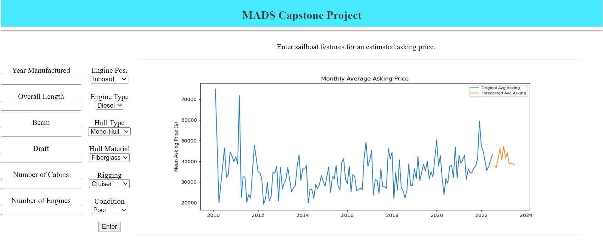
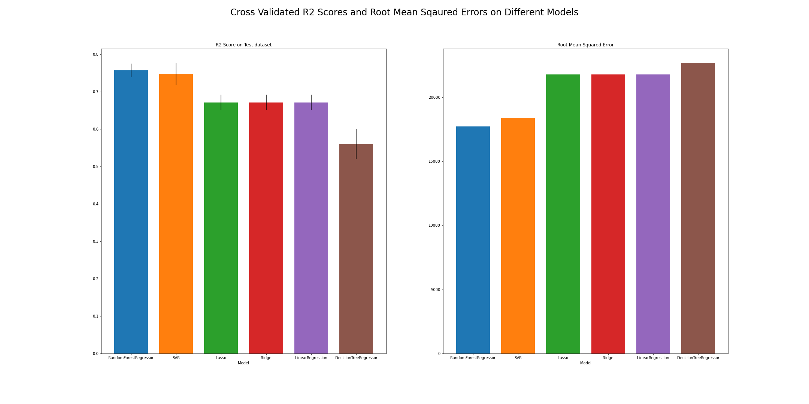
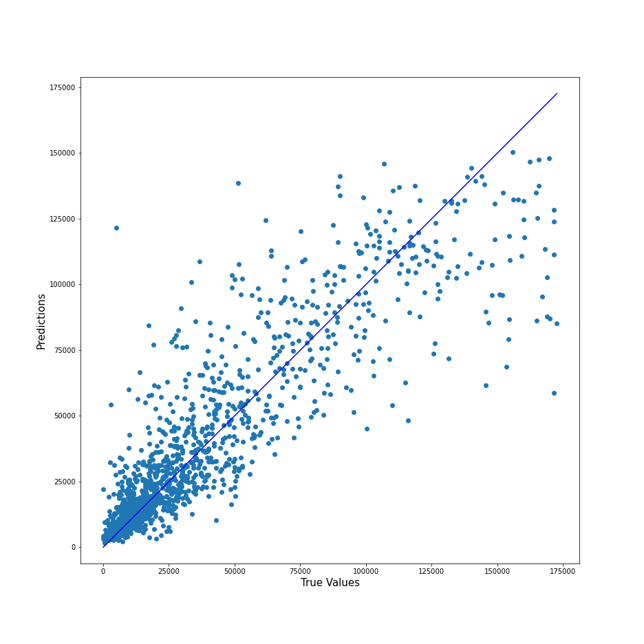

# MADS Summer 2022 Capstone Project

**Scrapes Used Sailboat Listings From https://www.sailboatlistings.com/sailboats_for_sale/**

**Trains random forest regressor to predict asking price.**

**Trains an arima model to forecast mean asking price.**

**Serves a web application using Flask and Azure web app services and Github Ations**

### Dependencies
Before running the project, all the dependencies in the requirements.txt have to be installed. 

`conda install -r requirements.txt` or `pip install -r rquirements.txt`

### Project Components

1. Data Wrangling
   - Uses requests, beautiful soup, and pandas library to scrape listings for sailboat features.
   - Features include.
       * Length
       * Beam
       * Draft
       * Year Manufactured
       * Hull Type
       * Material Type
       * No. Engines
       * No. Cabins
       * Rigging
       * Condition
       * Date Posted
       * Adjusted Asking Price 
   - 'Adjusted Asking Price' is the asking price after applying the consumer price index. This was done to accomodate for inflation.
   - Outliers in continuous features are removed using 1.5 * the inter-quartile range.

2. Regression Analysis

3. Forecasting

4. Flask application 
   - Azure web app services, https://mads-capstone22-teamsailors.azurewebsites.net)
  
   

5. Data Visualization Jupyter Notebook (contains exploratory data analysis, model selection, hyperparameter tuning) 
    - Data Visualization, https://drive.google.com/file/d/1zZnBVQP3Oe4wbj3-nQt9K_50b6ZHRMKx/view?usp=sharing
      - Variables Correlations.png
      - R2_RMSE.png
      - True Value V.S. Predicted Value.png
      - Feature Importance.png

The Jupyter Notebook demonstrates that Random Forest Regressor is the best performing model among all the other non-linear regression model, like Lasso,Ridge, SVR, Decision Tree Regressor, and linear regression model.

And the scatter plots of Actual vs Predicted shows that all the points are close to the regressed diagnoal line and indicates the Goodness of fit of the Random Forest Regressor model is strong.

